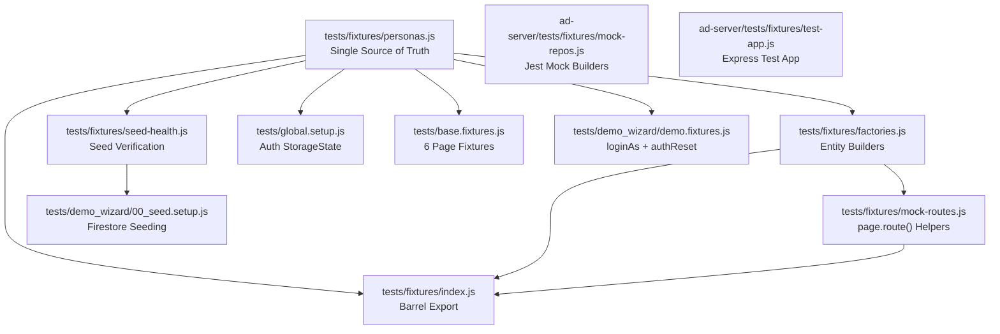

# Test Fixture Hardening — Walkthrough

## What Changed

The test infrastructure was fragmented across 5+ independently evolved fixture layers with no shared data contract, causing the 61-test cascade failure documented in the 2026-06-24 SRE report. This work establishes a unified, contract-tested, self-validating fixture system.

---

## Architecture (After)



The key design principle is **Dependency Inversion**: both `base.fixtures.js` (storageState) and `demo.fixtures.js` (loginAs) now depend on the shared `personas.js` abstraction rather than defining their own persona data.

---

## New Files (7)

### [personas.js](file:///c:/Users/ChrisFro/Desktop/EmoGini/softomedia-live2026/tests/fixtures/personas.js)

**Single source of truth** for all 6 persona definitions (`superadmin`, `admin`, `retailer`, `brand`, `advertiser`, `techoperator`), environment config (`BASE_URL`, `API_BASE_URL`, `DEMO_TOKEN`), and seeded resource IDs (`SEED`).

### [factories.js](file:///c:/Users/ChrisFro/Desktop/EmoGini/softomedia-live2026/tests/fixtures/factories.js)

Entity factory functions: `buildLoop()`, `buildCampaign()`, `buildRetailer()`, `buildStore()`, `buildScreen()`, `buildAdvertiser()`, `buildPlaylist()`, `buildAnalyticsSummary()`, `buildAdminStats()`, `buildPricing()`, `buildSlot()`. All use lowercase enums and snake_case fields per DATABASE_SCHEMA.md.

### [mock-routes.js](file:///c:/Users/ChrisFro/Desktop/EmoGini/softomedia-live2026/tests/fixtures/mock-routes.js)

Shared `page.route()` helpers: `mockLoopsApi()`, `mockLoopGenerateApi()`, `mockAnalyticsApi()`, `mockPlaylistApi()`, `mockScreenRegisterApi()`, `mockHeartbeatApi()`, `mockTelemetryApi()`, `mockAdminOverviewApi()`, `mockInfrastructureApis()`.

### [seed-health.js](file:///c:/Users/ChrisFro/Desktop/EmoGini/softomedia-live2026/tests/fixtures/seed-health.js)

`verifySeedHealth()` — confirms all seeded entities exist via GET requests. Called by `00_seed.setup.js` after seeding and available for any spec's `beforeAll()`.

### [index.js](file:///c:/Users/ChrisFro/Desktop/EmoGini/softomedia-live2026/tests/fixtures/index.js)

Barrel export for `personas.js`, `factories.js`, and `mock-routes.js`.

### [mock-repos.js](file:///c:/Users/ChrisFro/Desktop/EmoGini/softomedia-live2026/ad-server/tests/fixtures/mock-repos.js)

Shared Jest mock repository builders for backend tests: `createMockScreenRepository()`, `createMockAdRepository()`, `createMockRetailerRepository()`, and 7 more.

### [test-app.js](file:///c:/Users/ChrisFro/Desktop/EmoGini/softomedia-live2026/ad-server/tests/fixtures/test-app.js)

`createTestApp(router, path)` — shared Express app builder with JSON parsing and optional auth middleware injection.

---

## Modified Files (4)

### [global.setup.js](file:///c:/Users/ChrisFro/Desktop/EmoGini/softomedia-live2026/tests/global.setup.js)

- Now imports from `fixtures/personas.js` instead of hardcoding personas
- Registers all 6 personas (was 4; adds `superadmin` + `advertiser`)
- Writes both `authToken` (camelCase) and `auth_token` (snake_case) for backward compatibility
- Adds `linked_entity_id` to the mock user object

### [base.fixtures.js](file:///c:/Users/ChrisFro/Desktop/EmoGini/softomedia-live2026/tests/base.fixtures.js)

- Expanded from 3 page fixtures to 6: adds `superadminPage`, `advertiserPage`, `techoperatorPage`
- Added comprehensive JSDoc explaining how to add new personas

### [demo.fixtures.js](file:///c:/Users/ChrisFro/Desktop/EmoGini/softomedia-live2026/tests/demo_wizard/demo.fixtures.js)

- Persona constants + env config + SEED IDs now imported from `fixtures/personas.js`
- Re-exports everything for backward compatibility — all 17+ demo_wizard specs keep working unchanged
- Auth utility functions (`authReset`, `loginAs`, `assertRoleHeader`) remain here

### [00_seed.setup.js](file:///c:/Users/ChrisFro/Desktop/EmoGini/softomedia-live2026/tests/demo_wizard/00_seed.setup.js)

- Imports `verifySeedHealth` from `fixtures/seed-health.js`
- Adds a post-seed verification gate that confirms all entities exist via GET
- Converts silent seed failures into loud errors at suite startup

### [package.json](file:///c:/Users/ChrisFro/Desktop/EmoGini/softomedia-live2026/package.json)

New npm scripts:
| Script | Purpose |
|--------|---------|
| `test` | Runs `test:unit` then `test:e2e` |
| `test:unit` | Runs backend Jest suite |
| `test:e2e:mock` | Runs only mock-based E2E tests (fast CI feedback) |
| `test:e2e:seed` | Runs only seed-dependent E2E tests |
| `lint:tests`    | Runs custom guardrails (no inline JSON, no manual auth) against `tests/` |

---

## 2C Guardrails (Enforcement)

To prevent regression into fragmented mocks, we added `scripts/lint-tests.js`.
This custom linting script enforces two rules:
- **Rule 1**: Forbids raw JSON mocks (`JSON.stringify({ ... })`) inline within `page.route()`, forcing developers to use `factories.js`.
- **Rule 2**: Forbids manual auth state (`localStorage.setItem(...)`), forcing developers to use `loginAs()`.

## 2B Fail-Fast Preflight

We added `scripts/test-preflight.js` hooked into `pretest:e2e`. It pings `/health` and the Firestore Emulator (port `8090`) before Playwright boots, preventing a 61-browser cascade failure if the environment is down.

## Remaining Work (Deferred)

The following items are infrastructure-ready but require individual spec file migration (planned for a follow-up backend PR):

1. **Migrate backend tests** — Update 13 Jest files to use `mock-repos.js` and `test-app.js`.

*Note: Root-level Playwright specs have been migrated to factories, orphaned mock files deleted, and test tagging implemented.*

---

## Verification

To verify the fixture system:
```bash
# Check all fixture files exist and import cleanly
node -e "import('./tests/fixtures/index.js').then(m => console.log(Object.keys(m)))"

# Verify global.setup.js generates all 6 auth files
npx cross-env ALLOW_DEMO_MODE=false playwright test --list

# Run a demo wizard spec to confirm backward compatibility
npx cross-env ALLOW_DEMO_MODE=true playwright test tests/demo_wizard/01_admin_provision.spec.js --reporter=list
```
