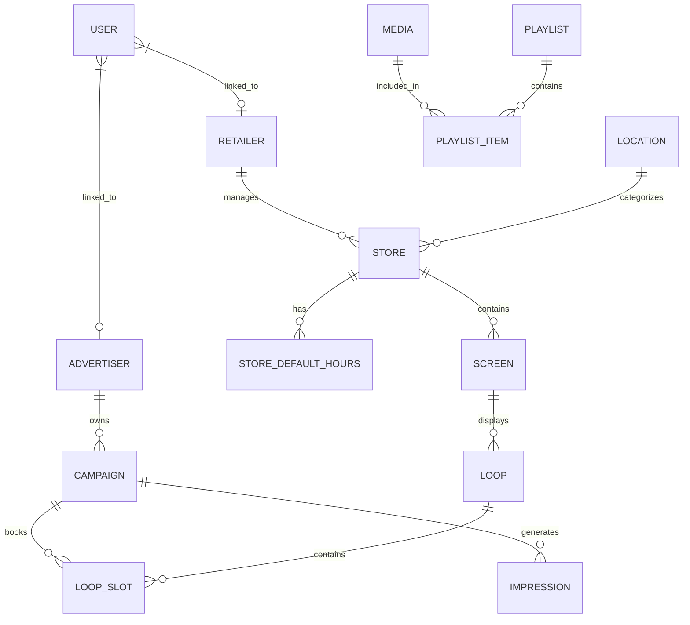

# Database Schema Documentation

This document describes the Firestore database structure for the Softomedia Live project.

## Technical Architecture

The data layer uses a **Repository Pattern** implemented in `BaseRepository.js`. This provides several key features:
- **Resilience**: A `CircuitBreaker` utility handles Firestore connection issues.
- **Hybrid Storage**: Real-time Firestore persistence with an in-memory `MOCK_STORAGE` fallback for local testing and offline modes.
- **Audit Fields**: Every record managed through the repository automatically includes:
    - `id`: Unique identifier (string)
    - `created_at`: ISO timestamp of creation
    - `updated_at`: ISO timestamp of last update

## Entity Relationship Diagram

## Collections

### `retailers`
Stores organizations that own the physical screen infrastructure.
| Field | Type | Description |
|-------|------|-------------|
| `id` | string | Unique identifier (e.g., `ret_001`) |
| `name` | string | Retailer name |
| `logo` | string | Emoji or URL for the logo |
| `contact_email`| string | Primary contact |
| `status` | string | 'active', 'inactive' |

### `stores`
Physical retail locations.
| Field | Type | Description |
|-------|------|-------------|
| `id` | string | Unique identifier |
| `retailer_id` | string | Foreign key to `retailers` |
| `location_id` | string | Foreign key to `locations` (region/district) |
| `name` | string | Store name (e.g., "Metro Downtown") |
| `address` | string | Street address |
| `city` | string | City location |
| `screen_count` | number | Total screens in store |
| `traffic_level`| string | 'low', 'medium', 'high' |
| `status` | string | 'active', 'maintenance', 'inactive' |

### `screens`
Individual digital signage units.
| Field | Type | Description |
|-------|------|-------------|
| `id` | string | Unique identifier |
| `screen_id` | string | Physical hardware ID |
| `name` | string | Friendly name (e.g., "Main Lobby") |
| `store_id` | string | Foreign key to `stores` |
| `retailer_id` | string | Foreign key to `retailers` |
| `status` | string | 'online', 'offline', 'error' |
| `resolution` | string | Display resolution (e.g., "1920x1080") |
| `last_seen` | timestamp| ISO string of last heartbeat |

### `advertisers`
Brands or agencies purchasing ad space.
| Field | Type | Description |
|-------|------|-------------|
| `id` | string | Unique identifier |
| `name` | string | Brand name |
| `industry` | string | Industry category |
| `contact_email`| string | Primary contact |
| `budget` | number | Total historical/lifetime budget |
| `status` | string | 'active', 'suspended' |

### `campaigns`
Specific advertising initiatives.
| Field | Type | Description |
|-------|------|-------------|
| `id` | string | Unique identifier |
| `advertiser_id`| string | Foreign key to `advertisers` |
| `name` | string | Campaign name |
| `status` | string | 'draft', 'pending', 'live', 'completed', 'paused' |
| `start_date` | date | Start date (YYYY-MM-DD) |
| `end_date` | date | End date (YYYY-MM-DD) |
| `budget` | number | Campaign specific budget |
| `spent` | number | Current spend |
| `creative_url` | string | Primary asset URL |
| `duration` | number | Slot duration in seconds |

### `loops`
The scheduling grid for a specific screen, date, and hour.
| Field | Type | Description |
|-------|------|-------------|
| `id` | string | Unique identifier (`screen_id`_`date`_`hour`) |
| `screen_id` | string | Target screen |
| `store_id` | string | Parent store |
| `retailer_id` | string | Parent retailer |
| `date` | string | Date (YYYY-MM-DD) |
| `hour` | number | Hour of day (0-23) |
| `status` | string | 'PENDING', 'APPROVED', 'LOCKED' |
| `slots` | array | Array of `slot` objects |

#### `slot` Object
| Field | Type | Description |
|-------|------|-------------|
| `index` | number | Sequence in the loop (0-11) |
| `status` | string | 'available', 'booked', 'blocked' |
| `campaign_id` | string | FK to `campaigns` (if booked) |
| `advertiser_id`| string | FK to `advertisers` (if booked) |
| `creative_url` | string | Asset URL for this slot |

### `media`
Reusable creative assets.
| Field | Type | Description |
|-------|------|-------------|
| `id` | string | Unique identifier |
| `filename` | string | Original filename or title |
| `file_type` | string | 'image', 'video' |
| `duration` | number | Playback duration in seconds |
| `url` | string | Cloud Storage URL |

### `pricing_config`
Global and overridden pricing settings.
| Field | Type | Description |
|-------|------|-------------|
| `id` | string | Usually `global` |
| `baseCPM` | number | Base cost per thousand impressions |
| `currency` | string | ISO currency code (default: 'USD') |
| `trafficTiers` | object | Map of tier IDs to tier settings |
| `dateOverrides`| object | Map of dates to pricing overrides |
| `retailerOverrides`| object | Custom rules per retailer |

### `users`
System users and authentication links.
| Field | Type | Description |
|-------|------|-------------|
| `id` | string | Unique identifier (Firebase UID) |
| `email` | string | User email |
| `role` | string | 'admin', 'retailer', 'brand', 'manager', 'tech' |
| `name` | string | Full name |
| `linked_entity_id`| string | FK to `retailers` or `advertisers` |

### `impressions`
Real-time playback logs.
| Field | Type | Description |
|-------|------|-------------|
| `id` | string | Unique identifier |
| `campaign_id` | string | Tracked campaign |
| `screen_id` | string | Target hardware |
| `timestamp` | timestamp| Completion time |
| `location_id` | string | Region identifier |
| `playlist_source`| string| Source type ('assigned', 'global') |
