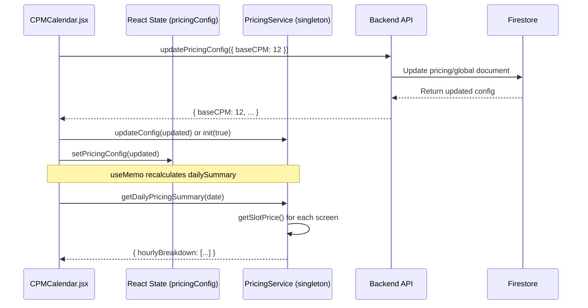

# SRE Incident Report: CPM Pricing Calculation Mismatch

**Date:** 2026-01-11  
**Status:** OPEN - Under Investigation  
**Severity:** Medium (Data Display Inconsistency)  
**Component:** `client-app/src/pages/admin/CPMCalendar.jsx`, `client-app/src/services/PricingService.js`

---

## Executive Summary

The "Avg Slot CPM" column in the CPM Pricing Calendar displays incorrect values after updating the Base CPM. Specifically, setting Base CPM to $12 results in Medium tier (1.0x multiplier) showing $11.00 instead of the expected $12.00.

---

## Symptoms

| Base CPM | Traffic Tier | Expected Avg CPM | Actual Avg CPM | Delta |
|----------|--------------|------------------|----------------|-------|
| $10.00 | Medium (1.0x) | $10.00 | $10.00 | ✅ 0 |
| $12.00 | Medium (1.0x) | $12.00 | **$11.00** | ❌ -$1.00 |
| $12.00 | High (1.5x) | $18.00 | **$16.50** | ❌ -$1.50 |

**Key Observation:** When Base CPM is $12, all calculated prices appear to use **$11** as the base (e.g., $11 × 1.5 = $16.50 for High tier).

---

## System Architecture



---

## Attempted Fixes

### 1. Fixed `updateConfig` OR Operator Bug
**Hypothesis:** The OR operator (`||`) in `PricingService.updateConfig` was causing stale value fallback.

**Change:**
```diff
- baseCPM: newConfig.baseCPM || newConfig.base_cpm || this.config?.baseCPM || 15.00
+ if (newConfig.baseCPM !== undefined) {
+     this.config.baseCPM = Number(newConfig.baseCPM);
+ }
```

**Result:** ❌ Did not resolve the issue. Debug logs confirmed `baseCPM: 12` was set correctly in singleton.

---

### 2. Added `forceRefresh` to `init()` Method
**Hypothesis:** The singleton's initial guard (`if (this.config) return;`) prevented re-fetching data after updates.

**Change:**
```javascript
async init(forceRefresh = false) {
    if (this.config && !forceRefresh) return;
    // ... re-fetch all data from backend
}
```

**Result:** ❌ Did not resolve the issue. Console confirmed full re-initialization with `baseCPM: 12`.

---

### 3. Timezone Bug Fix (Separate Issue - RESOLVED)
**Hypothesis:** Date strings parsed via `new Date(selectedDate)` caused UTC offset, showing wrong date.

**Change:** Replaced all `toISOString()` with `toLocaleDateString('en-CA')` for YYYY-MM-DD format.

**Result:** ✅ Calendar now shows correct selected date.

---

## Current Hypothesis

### Theory: Stale Screen/Store Data or Retailer Override

The "Avg Slot CPM" is calculated as:
```
Average = Sum(Base × TrafficTier × DateMultiplier × StoreTraffic) / TotalScreens
```

Possible causes for the $11 value with $12 base:

| Scenario | Calculation | Result |
|----------|-------------|--------|
| One screen has retailer override of $8 | (12 + 12 + 12 + 8) / 4 | $11.00 ✅ Match! |
| Mixed store traffic multipliers | (12×1.25 + 12×0.8 + ...) / 4 | ~$11.xx |
| Backend not returning full config | Only partial update saved | Stale data persists |

**Most Likely Root Cause:**  
A **Retailer Override** exists in the database that sets one or more screens to a lower Base CPM (e.g., $8). Since the "Avg Slot CPM" averages across all 4 screens, the override drags down the average.

---

## Recommended Next Steps

1. **Database Inspection:**
   ```bash
   # Check pricing/global document for retailerOverrides
   firebase firestore:get pricing/global --project softomedia-live-2026
   ```

2. **Add Override Visibility:**
   - Display active retailer overrides in the tooltip for each hour
   - Show per-screen breakdown instead of just average

3. **API Contract Verification:**
   - Log the full API response after `updatePricingConfig` to verify no data loss
   - Confirm `retailerOverrides` are not being applied unintentionally

4. **Unit Test:**
   - Create a test case with known screen/store/retailer data
   - Verify `getSlotPrice()` returns expected values

---

## Files Modified During Investigation

| File | Changes |
|------|---------|
| `PricingService.js` | Added `forceRefresh` to `init()`, explicit `updateConfig` logic, debug logging |
| `CPMCalendar.jsx` | Changed `handleSaveBaseCPM` to use `init(true)`, fixed timezone bugs |
| `PricingRepository.js` | Sanitized snake_case keys cleanup |

---

## Attachments

### Screenshot: Bug Evidence
The screenshot shows Base CPM = $12.00, but Medium tier displays $11.00.


---

*Report generated by AI debugging assistant. Requires human verification of database state and retailer override configuration.*
